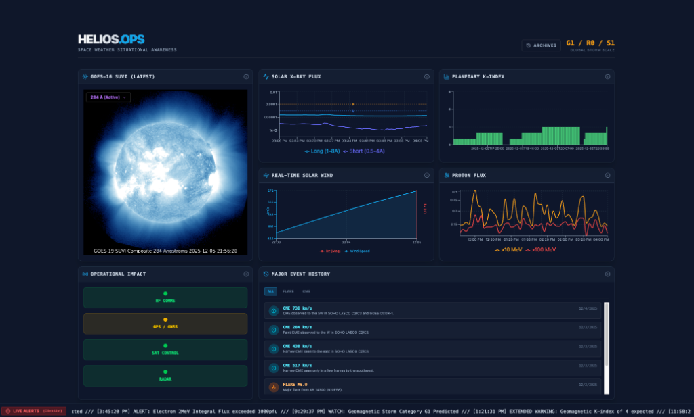

# Helios.Ops Space Weather Dashboard

A single-pane-of-glass operational dashboard for monitoring Space Weather events in real-time. Features live data from NOAA SWPC, GOES-16 solar imagery, and a historical replay system.



## Technology Stack

*   **Frontend:** React, TypeScript, Vite, Tailwind CSS, Recharts.
*   **Backend:** Python, FastAPI, SQLModel (SQLite), APScheduler.
*   **Data Sources:** NOAA SWPC (Live), NASA DONKI (History).

## Prerequisites

*   **Node.js** (v18+)
*   **Python** (v3.10+)

## Quick Start

### 1. Backend Setup (Archival Service)

The backend handles data archiving and serves the time-travel API.

```bash
cd backend
python3 -m venv venv
source venv/bin/activate  # On Windows: venv\Scripts\activate
pip install -r requirements.txt

# Start the server (runs on localhost:8000)
python main.py
```

*Note: The backend will immediately start fetching live data every 5 minutes to populate the database.*

### 2. Frontend Setup (Dashboard)

Run the dashboard interface.

```bash
# In the project root (space-dashboard/)
npm install
npm run dev
```

Open your browser to `http://localhost:5174` (or whatever port Vite assigned).

## Features

### Live Mode
*   **Solar Imagery:** Real-time **GOES-16 SUVI** feed (131Å - 304Å).
*   **Charts:** X-Ray Flux, Proton Flux, Solar Wind (plasma/mag), Kp Index.
*   **Operatonal Impact:** Real-time status matrix for HF Comms, GPS, Satellites, and Radar.
*   **Alerts:** Live scrolling ticker of NOAA SWPC alerts. Click to view full text.

### Archive Mode (Time Travel)
*   Click the **"ARCHIVES"** button in the header.
*   Select a date range or a specific major event.
*   The dashboard toggles to **Replay** mode, sourcing data from your local `backend/space_weather.db`.
*   *Note: Replay allows you to analyze past events exactly as they appeared.*

## API Keys (Optional)

Historical major event logs use the NASA DONKI API.
To prevent rate-limiting, replace `'DEMO_KEY'` in `src/api/nasa.ts` with your own key from [api.nasa.gov](https://api.nasa.gov/).

## Architecture

*   `src/`: React Frontend.
*   `backend/`: FastAPI Backend.
*   `backend/space_weather.db`: Local SQLite database for archives.
